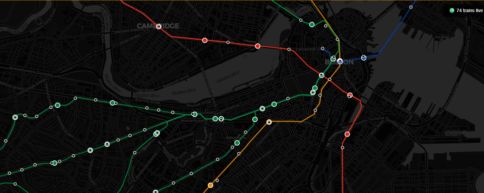
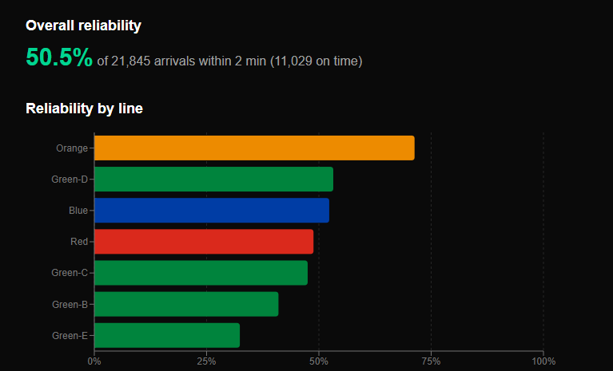
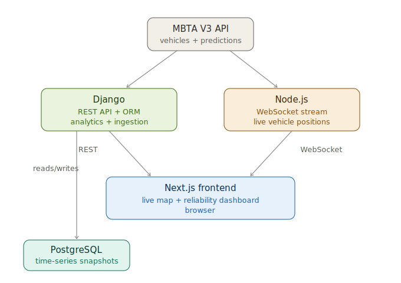

# TransitPulse

A real-time MBTA transit tracker and reliability dashboard. TransitPulse streams live subway positions onto a map and analyzes how reliable each line actually is — comparing predicted arrival times against when trains actually showed up.

Built as a full-stack systems project: a live WebSocket data pipeline, a time-series analytics engine, and a multi-service architecture containerized with Docker.

## What it does

- **Live map** — subway trains rendered in real time on a Boston map, colored by line, animated along real track geometry, updating every ~2 seconds over WebSockets.
- **Reliability dashboard** — computed analytics over collected data: overall on-time rate, per-line reliability, a line-by-hour delay heatmap, and delay breakdowns by line, stop, and hour.

Over multiple days of continuous collection, TransitPulse ingested:

- **75,378** vehicle position snapshots
- **1,462,800** arrival predictions
- across **7** subway lines and **258** stops

## Key findings

From the collected data (measured, not estimated):

- **50.5%** of arrivals came within 2 minutes of their earliest prediction (21,786 matched arrivals; 10,994 on time).
- **Reliability varies sharply by line** — Orange was the most reliable (~70%), while the Green Line E branch was the least (~33%).
- **Delays worsen at evening rush** — average delay peaks around 6 PM (18:00) at ~6 minutes, versus under a minute late at night.
- **Green-E is the worst performer** on both reliability and average delay (5.83 min avg), consistent with the branch's known real-world issues.

## Screenshots

<!-- Add your images to a docs/ folder and update these paths -->

**Live map**



**Reliability dashboard**



## Architecture



### Why two backends?

The two services do fundamentally different work, so they're separated by concern:

- **Django** handles the heavy, request-response work: it owns the PostgreSQL schema through its ORM, runs the ingestion job that polls the MBTA API, and computes the reliability and delay analytics served over a REST API.
- **Node.js** handles the lightweight, persistent real-time layer: it holds the streaming connection to the MBTA feed and pushes live vehicle positions to the browser over WebSockets.

Putting a long-lived WebSocket workload inside the request-response Django service would mix two very different runtime models. Keeping them separate lets each do what it's good at.

## Tech stack

- **Next.js** (TypeScript) — frontend: live Leaflet map and the reliability dashboard (Recharts)
- **Django** (Python) — REST API, ORM-owned Postgres schema, analytics engine, ingestion job
- **Node.js** (TypeScript) — real-time WebSocket service streaming vehicle positions
- **PostgreSQL** — time-series storage for snapshots and predictions
- **Docker** — all three services + Postgres containerized via Docker Compose
- **GitHub Actions** — CI that builds all three service images on every push

## Running it

### Option 1 — Docker (self-contained)

Runs the entire stack — frontend, both backends, and a Postgres database — with one command:

```bash
docker compose up --build
```

Then open http://localhost:3000 (map) and http://localhost:3000/dashboard (analytics).

The containerized database starts empty; run the ingestion job to collect data (see below), or the dashboard will show empty states until data accumulates.

### Option 2 — Native 

Requires local PostgreSQL, Python (venv), and Node. A `Makefile` wraps the startup:

```bash
make dev     # starts Postgres, Django (:8000), and the frontend (:3000)
make stop    # stops Django and the frontend
make logs    # tails the service logs
```

### Collecting data

The ingestion job polls the MBTA API and stores snapshots and predictions. Run it continuously to accumulate reliability data:

```bash
cd backend-django && source venv/bin/activate
python manage.py ingest_vehicles --loop
```

It polls every 60 seconds, is resilient to API errors, and shuts down cleanly on Ctrl+C.

## Methodology & reflection

Reliability is measured against each trip's **earliest** recorded prediction for a stop — the original "promise" made to riders — which is the strictest reasonable baseline. An arrival is counted as an actual arrival at the moment a train is first reported `STOPPED_AT` a stop.

The headline numbers here come from ~36 hours of continuous collection. A longer collection window would smooth out under-sampled hours (early morning has fewer data points) and is the natural next step.

## Requirements

- Docker and Docker Compose (for Option 1)
- PostgreSQL, Python 3.12+, Node.js 24 (for Option 2)
- A free MBTA V3 API key (https://api-v3.mbta.com), set as `MBTA_API_KEY` in a root `.env` file